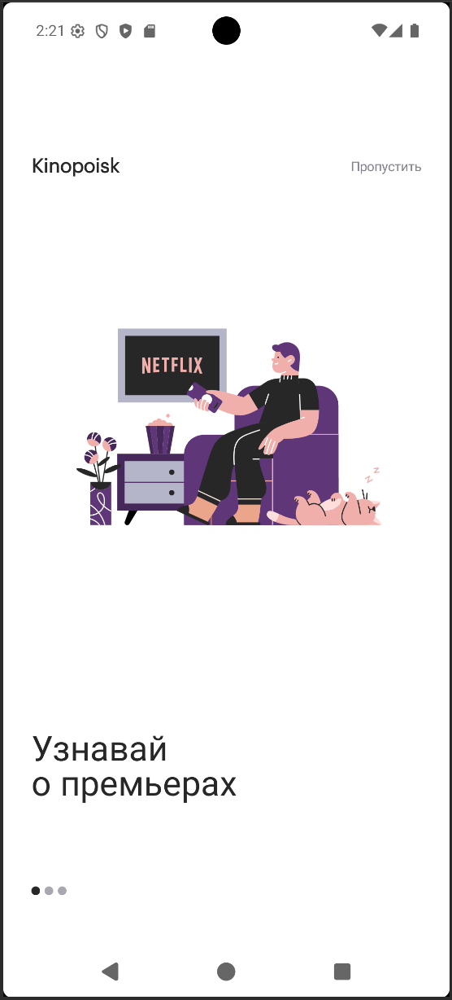
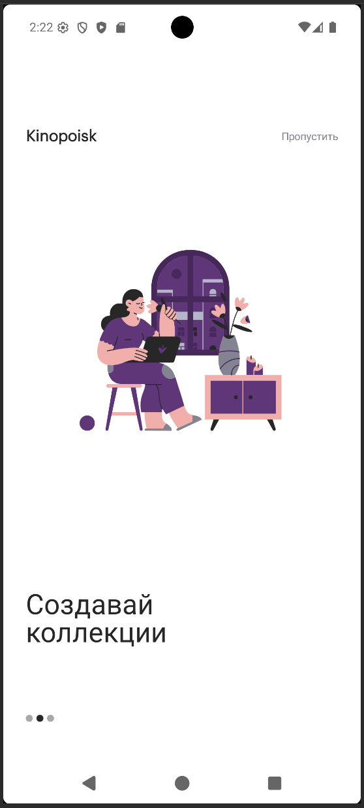
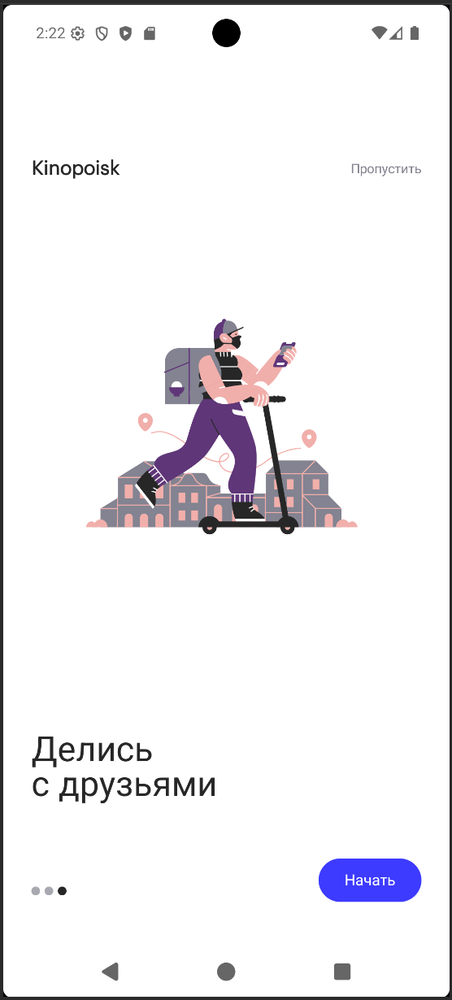
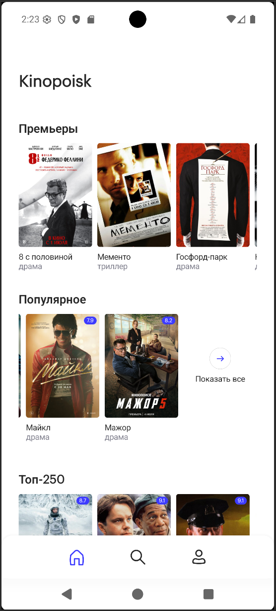

# Kinopoisk App
#### Приложение для поиска фильмов и сериалов, а так же создания библиотеки

## Реализовано:
- 27.05.26 - добавлены модули, подготовлен "скелет" приложения
- 30.05.26 - добавлен detekt плагин, настроен github actions
- 08.06.26 - добавлена тема, шрифты, цвета и тд
- 19.06.26 - добавлен data-слой с retrofit и room
- 01.07.26 - добавлена реализация репозиториев
- 19.07.26 - закончен экран Onboarding
- 30.07.26 - на экран Home добавлена карусель из 4 подборок, без перехода на всю подборку


<p>
  
  
  
  
</p>


### 1. Как будет устроена модульность

Приложение разделено на `app`, `core:*` и `feature:*`.

`app` — точка сборки приложения.  
Собирает все feature-модули, собирает `NavHost`, показывает `bottom bar`, содержит `MainActivity`, `Application`, стартовую логику onboarding.

`core:*` — общая инфраструктура и слои:
- `core:common` — общие типы вроде `AppResult`, `AppError`.
- `core:domain` — бизнес-модели, repository interfaces, use cases.
- `core:data` — реализации repository, мапперы, data sources.
- `core:network` — Retrofit API, DTO, OkHttp, API key interceptor.
- `core:database` — Room database, DAO, entities.
- `core:datastore` — DataStore/preferences.
- `core:designsystem` — тема, цвета, типографика, общие UI-компоненты.
- `core:navigation` — общие route-описания.

`feature:*` — отдельные "экраны" приложения:
- `feature:home`
- `feature:onboarding`
- `feature:search`
- `feature:profile`

Каждая feature отвечает за свой экран/flow: UI, ViewModel, UI state, локальные UI-модели. Например, `feature:home` не ходит напрямую в Retrofit или Room. Он обращается к `core:domain` use case, а уже domain через интерфейс получает данные из `core:data`.

Главный принцип: зависимости идут снаружи внутрь, а не наоборот.  
`domain` не знает про `data`, `network`, `database`, `Compose`, `Android`. 
`feature` не знает про Retrofit/Room. 
`data` знает про domain-контракты и реализует их.

Пример на главной (room-кеш пока не реализован, ходим в сеть напрямую):

```text
HomeScreen
  -> HomeViewModel
    -> GetPremieresUseCase
      -> FilmRepository interface
        -> FilmRepositoryImpl
          -> NetworkFilmDataSource
            -> KinopoiskApi
```

То есть UI не знает, откуда пришли фильмы: из сети, базы, кэша или тестового репозитория. Это и даёт расширяемость: позже буду добавлять Room-кэш, пагинацию, offline-first, тестовые fake repository — не переписывая экран.

---

### 2. AppResult и AppError

`AppResult` и `AppError` нужны, чтобы приложение **не таскало исключения по всем слоям** и работало с ошибками единообразно.

`AppResult` — это оболочка результата операции:

```kotlin
sealed interface AppResult<out T> {
    data class Success<T>(val data: T) : AppResult<T>
    data class Error(val error: AppError) : AppResult<Nothing>
}
```

То есть любой use case/repository может вернуть либо данные:

```kotlin
AppResult.Success(films)
```

либо ошибку:

```kotlin
AppResult.Error(AppError.Network)
```

Это позволяет сделать так, что:
- ViewModel не ловит `IOException`, `HttpException`, `SerializationException`;
- UI получает понятное состояние: успех или ошибка;
- ошибки становятся частью обычной логики, а не внезапным crash;
- удобно делать `when`:

```kotlin
when (val result = getPopularFilmsUseCase()) {
    is AppResult.Success -> showFilms(result.data)
    is AppResult.Error -> showError(result.error)
}
```

`AppError` — это список ошибок, которые приложение понимает на уровне бизнес/UI-логики:

```kotlin
sealed interface AppError {
    data object Network : AppError
    data object Unauthorized : AppError
    data object NotFound : AppError
    data object Unknown : AppError
}
```

Он скрывает технические детали. Например, в `data`-слое может произойти:

```text
IOException
HttpException 401
HttpException 403
HttpException 404
SerializationException
SQLException
```

Но UI не должен знать про все эти технические классы. Поэтому `safeDataCall` превращает их в понятные ошибки:

```text
IOException -> AppError.Network
401/403 -> AppError.Unauthorized
404 -> AppError.NotFound
SerializationException -> AppError.Unknown
SQLException -> AppError.Unknown
```

А потом `feature:home` уже решает, какой текст показать:

```kotlin
AppError.Network -> "Проверьте подключение к интернету."
AppError.Unauthorized -> "Проверьте API-ключ."
AppError.NotFound -> "Подборка не найдена."
AppError.Unknown -> "Попробуйте загрузить секцию ещё раз."
```

`AppResult` и `AppError` лежат в `core:common` потому, что ими пользуются разные слои:

```text
core:network/data -> создают AppResult/AppError
core:domain -> возвращает AppResult из repository/use case
feature:* -> читает AppResult и показывает UI state
```

```text
AppResult = успех или ошибка
AppError = тип ошибки, понятный приложению
```

Без них пришлось бы либо ловить исключения во ViewModel, либо прокидывать технические ошибки из Retrofit/Room прямо в UI.

---

### 3. safeDataCall

`safeDataCall` нужен, чтобы **безопасно выполнить запрос к источнику данных** и превратить технические исключения в общий `AppResult`. Лежит в в `core:data`.


Используется, например, в `NetworkFilmDataSource`:

```kotlin
suspend fun getPremieres(year: Int, month: String): AppResult<PremieresResponse> = safeDataCall {
    kinopoiskApi.getPremieres(year = year, month = month)
}
```

Как это работает:

```text
1. Выполняем Retrofit-запрос
2. Если всё хорошо -> AppResult.Success(response)
3. Если ошибка сети -> AppResult.Error(AppError.Network)
4. Если 401/403 -> AppResult.Error(AppError.Unauthorized)
5. Если 404 -> AppResult.Error(AppError.NotFound)
6. Если ошибка парсинга JSON -> AppResult.Error(AppError.Unknown)
7. Если coroutine cancellation -> пробрасываем дальше
```


Зачем это нужно:

```text
Retrofit/Room/IO exceptions
    ↓
safeDataCall
    ↓
AppResult.Success / AppResult.Error
    ↓
Repository
    ↓
UseCase
    ↓
ViewModel
    ↓
UI state
```

То есть `ViewModel` не знает про `IOException`, `HttpException`, `SerializationException`, `SQLException`. Она работает только с понятным результатом:

```kotlin
when (val result = getPremieresUseCase()) {
    is AppResult.Success -> showContent(result.data)
    is AppResult.Error -> showError(result.error)
}
```

`safeDataCall` - единая точка защиты от технических ошибок data layer. Без него пришлось бы в каждом data source/repository писать одинаковые `try/catch`, и ошибки быстро стали бы обрабатываться по-разному.

---

### 4. Onboarding сейчас реализован так

Как отдельный feature-модуль:

```text
feature:onboarding
```

Логика такая:

```text
App стартует
  ↓
KinopoiskAppViewModel проверяет флаг onboarding в DataStore
  ↓
Если onboarding не завершён -> открывается OnboardingRoute
  ↓
Пользователь нажимает "Пропустить" или "Начать"
  ↓
OnboardingViewModel сохраняет флаг завершения
  ↓
app делает navigate на Home
```

Флаг первого запуска хранится не в UI, а через domain/data цепочку:

```text
feature:onboarding
  -> SetOnboardingCompletedUseCase
    -> OnboardingRepository
      -> OnboardingRepositoryImpl
        -> AppPreferencesDataSource
          -> DataStore
```

То есть экран не знает напрямую про DataStore.

В `app` стартовый flow выбирается в `KinopoiskApp.kt`

Там `KinopoiskAppViewModel` отдаёт состояние:

```kotlin
KinopoiskAppUiState.Loading
KinopoiskAppUiState.Onboarding
KinopoiskAppUiState.Main
```

Пока читается DataStore — показываем загрузку.  
Если onboarding ещё не пройден — стартуем с `onboarding`.  
Если уже пройден — стартуем с `home`.

Экран onboarding внутри себя:
- показывает 3 страницы;
- использует pager;
- отображает кнопку `Пропустить`;
- на последнем экране показывает кнопку `Начать`;
- по завершению вызывает callback `onOnboardingFinished`.


```text
OnboardingScreen отвечает за UI
OnboardingViewModel отвечает за событие завершения
Domain use case отвечает за бизнес-действие
DataStore хранит флаг
App выбирает стартовый route
```

onboarding показывается только при первом запуске, а после сохранения флага пользователь сразу попадает на главную.


